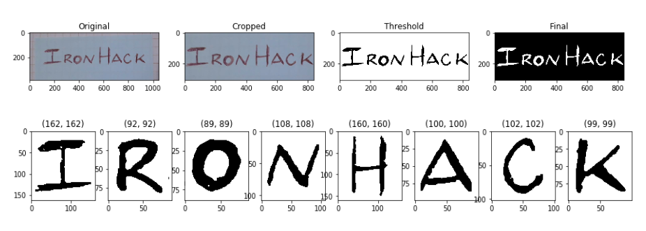
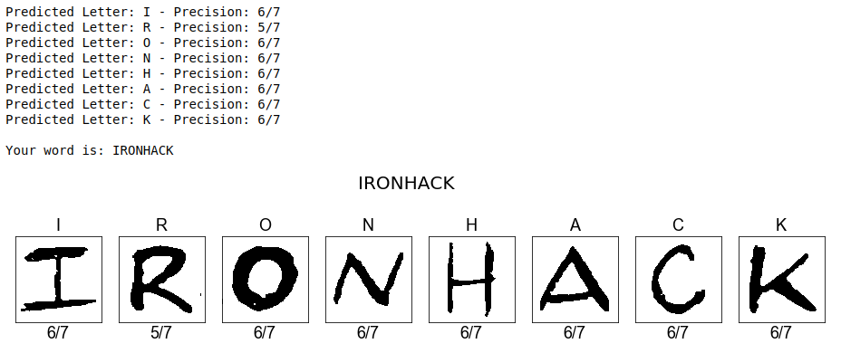

# OCR Optical Character Recognition

## :boom: Handwritten Text Recognition. Convolutional Neural Network

IronHack Data Analytics Bootcamp Final Project. 

This python script main goal is to read a handwritten word, connect to the Oxford Dictionary API return its meaning.

## :computer: Technology stack
Wrote in python 3. Main modules:

**OpenCV** -> Image reading and processing

**TensorFlow** -> Model training and prediction

Some additional modules used in this script: Matplotlib, Requests, NumPy.

## :camera: Image handling

OpenCV is used to scan and process handwritten text. This word is break down into letters and then passed one by one to model predict function to predict each letter individually. 

Improve prediction accuracy by uploading pictures with great contrast, dark letters on light color backgrounds. Go to data/test for some examples and get and idea of what images should be used with this model. 

As a first step, the original image is cropped to remove unwanted noise at the edges, then it is passed to a threshold function and gets its colors inverted. Finally, contours are located using the findContour function and split into an array of individual letters. A step by step process visualization is shown below.

<p align="center">
  
</p>

<p align="center">
  
</p>

## :microscope: Model Overview and Flowchart

Our model will be trained using 3 Conv2D layers.

Each of the 3 layers has 64 units and a kernel of size 3x3. The activation process is done using a Rectified Linear Unit (RELU). After each convolutional layer comes a pooling layer of size 2x2 as well as a 0.2 dropout. As optimizer we will use "adam" and "Categorical Crossentropy" as loss function. 
The fitting process iterates through 6 epochs, takes a batch size of 32 and has a validation split of 0.2.

Tensorboard was used to compare different models taking the one that best performed. Training run logs are saved to data/logs.

The training was done using 800 grayscale images per letter, totallig 20.800 images (800 x 26 letters). All images were resized to 100x100. The training process returned a loss and accuracy of 0.14 and 0.95 respectively.

<p align="center">
  
</p>

## :chart_with_upwards_trend: Model Stats

### Fitting

Model's name:  8888888888888888888888888888

Model: "sequential"

| Layer (type)                 | Output Shape              | Param # | 
| ---------------------------- | ------------------------- | ------- |
| conv2d (Conv2D)              | (None, 128, 128, 64)      | 1792    |
| max_pooling2d (MaxPooling2D) | (None, 64, 64, 64)        | 0       |
| conv2d_1 (Conv2D)            | (None, 62, 62, 64)        | 36928   | 
| max_pooling2d_1 (MaxPooling2 | (None, 31, 31, 64)        | 0       | 
| conv2d_2 (Conv2D)            | (None, 29, 29, 64)        | 36928   | 
| max_pooling2d_2 (MaxPooling2 | (None, 14, 14, 64)        | 0       | 
| flatten (Flatten)            | (None, 12544)             | 0       | 
| dense (Dense)                | (None, 1)                 | 12545   | 

Total params: 88,193, Trainable params: 88,193, Non-trainable params: 0

### Training

Train on 4800 samples, validate on 1200 samples

Epoch 1/10 -
4800/4800  - 66s 14ms/sample - loss: 0.6873 - accuracy: 0.5437 - val_loss: 0.6781 - val_accuracy: 0.5308

Epoch 2/10 -
4800/4800  - 67s 14ms/sample - loss: 0.6752 - accuracy: 0.5794 - val_loss: 0.6690 - val_accuracy: 0.6000

Epoch 3/10 -
4800/4800  - 66s 14ms/sample - loss: 0.5142 - accuracy: 0.7406 - val_loss: 0.2955 - val_accuracy: 0.8967

Epoch 4/10 -
4800/4800  - 65s 14ms/sample - loss: 0.2591 - accuracy: 0.9127 - val_loss: 0.2958 - val_accuracy: 0.9367

Epoch 5/10 -
4800/4800  - 66s 14ms/sample - loss: 0.2284 - accuracy: 0.9240 - val_loss: 0.2841 - val_accuracy: 0.9367

Epoch 6/10 -
4800/4800  - 65s 14ms/sample - loss: 0.2408 - accuracy: 0.9146 - val_loss: 0.2588 - val_accuracy: 0.9242

Epoch 7/10 -
4800/4800  - 65s 14ms/sample - loss: 0.2040 - accuracy: 0.9319 - val_loss: 0.2698 - val_accuracy: 0.9200

Epoch 8/10 -
4800/4800  - 66s 14ms/sample - loss: 0.1943 - accuracy: 0.9323 - val_loss: 0.2508 - val_accuracy: 0.9392

Epoch 9/10 -
4800/4800  - 66s 14ms/sample - loss: 0.1585 - accuracy: 0.9463 - val_loss: 0.2200 - val_accuracy: 0.9283

Epoch 10/10 -
4800/4800  - 66s 14ms/sample - loss: 0.1415 - accuracy: 0.9471 - val_loss: 0.2224 - val_accuracy: 0.9383

### Model performance

6000/6000  - 27s 5ms/sample - loss: 0.1421 - accuracy: 0.9588

Performance could be increased by training the same model with more original images. Since tensorboard functionality is already implemented, additional tweaks could be easily added to improve performance.

## :wrench: Configuration
Install python and mandatory dependendencies listed in requirements files. 

If you are using the anaconda distribution. Run the following command to create a new environment named 888888888

```
conda env create -f requirements.yml
```

**Note:** Environment managers differ from one another. It's strongly recommended to check its documentation.

## :snake: Running the main.py script

Just running main.py on your terminal won't get you any results. You should use one or a combination of the following flags:

**Training** -t or --train: trains the model using data found in the data/alphabet folder. Once trained, model weights and parameters are saved in the data/model folder as a model.h5 file.

Terminal command `python main.py -t`

**Predicting Images** -p or --predict: loads a previously trained model and analyzes an image. Predictions will be print to the terminal. If no image is selected, it will analyze ironhack.png (default image example).

Terminal command: `python main.py -p`

Terminal result:
```
Model loaded successfully!
Contours found: 8
Contours split: 8
(132, 152) Area: 20064
(82, 75) Area: 6150
(78, 79) Area: 6162
(77, 98) Area: 7546
(150, 99) Area: 14850
(85, 90) Area: 7650
(92, 74) Area: 6808
(89, 88) Area: 7832

Predicted Letter: I - Precision: 6/7
Predicted Letter: R - Precision: 6/7
Predicted Letter: O - Precision: 6/7
Predicted Letter: N - Precision: 6/7
Predicted Letter: H - Precision: 6/7
Predicted Letter: A - Precision: 6/7
Predicted Letter: C - Precision: 6/7
Predicted Letter: K - Precision: 6/7

Your word is: IRONHACK
```

**Image Selection** -i or --image: selects an image file. This command should be used alongside -p. Picking an image is mandatory if this flag is used.

Terminal command: `python main.py -pi data/test/python.jpeg`

Terminal result:
```
Model loaded successfully!
Contours found: 6
Contours split: 6
(186, 106) Area: 19716
(185, 100) Area: 18500
(173, 115) Area: 19895
(171, 117) Area: 20007
(131, 114) Area: 14934
(141, 134) Area: 18894

Predicted Letter: P - Precision: 6/7
Predicted Letter: Y - Precision: 6/7
Predicted Letter: T - Precision: 3/7
Predicted Letter: H - Precision: 6/7
Predicted Letter: O - Precision: 6/7
Predicted Letter: N - Precision: 6/7

Your word is: PYTHON

```

**Dictionary Search** -s or --search: Connects to the Oxford dictionary API and returns the word meaning. This command should be used alongside -pi or -p. Note that for this command to work, you should have an oxford API account and its credentials placed into a .env file. Check the .env_example file for more details.

Terminal command: `python main.py -pi data/test/python.jpeg`

Terminal result:
```
Model loaded successfully!
Contours found: 6
Contours split: 6
(186, 106) Area: 19716
(185, 100) Area: 18500
(173, 115) Area: 19895
(171, 117) Area: 20007
(131, 114) Area: 14934
(141, 134) Area: 18894
Predicted Letter: P - Precision: 6/7
Predicted Letter: Y - Precision: 6/7
Predicted Letter: T - Precision: 5/7
Predicted Letter: H - Precision: 6/7
Predicted Letter: O - Precision: 6/7
Predicted Letter: N - Precision: 5/7

Your word is: PYTHON

MEANING:
A large heavy-bodied nonvenomous snake occurring throughout the old world tropics, killing prey by constriction and asphyxiation.
```


## :information_source: Data set info

All original letters used to train the model were handwritten by me.

This script uses keras data augmantation function to generate 800 images from 40 original ones. This image generation process is repeated per each letter so we end up with 20.800 images (800 x 26 Letters)


## :file_folder: Folder structure
```
└── OCR
    ├── .gitignore
    ├── .env_example
    ├── requirements.yml
    ├── requirements.txt
    ├── README.md
    ├── main.py
    ├── readme
    │   ├── ironhacklogo.png
    │   └── pdf_result.png
    ├── packages
    │   ├── Acquisition
    │   |   ├── acquisition.py
    │   │   └── terminal_cmd.py
    │   ├── Model
    │   |   └── model.py
    │   ├── Image_Handling
    │   |   └── handler.py
    │   └── Dictionary
    │       └── meaning.py
    └── data
        ├── logs
        │   └── Malaria-CNN-1585423128
        ├── model
        |   ├── model.h5
        |   ├── ModelSummary.txt
        │   └── TrainingStats.txt
        ├── prediction
        │   └── IRONHACK.png
        ├── alphabet
        |   ├── A
        |   ├── B
        |   ├── C
        |   ├── ... (26 folders)
        |   ├── X
        |   ├── Y
        │   └── Z
        └── test
            └── ironhack.png
```

## :star: Acknowledgements


[IronHack](https://www.ironhack.com/en "IronHack main webpage")

## :love_letter: Contact info
Any doubt? Advice?  Drop me a line! :smirk:
