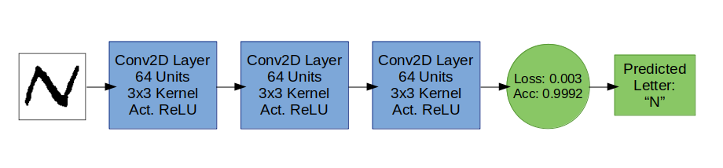

# Malaria_Detection CNN

## :boom: Malaria-infected cell detection. Convolutional Neural Network

This project's idea came from the desire to apply deep learning knowledge into a real-life problem. This Neural Network goal is to determine whether a cell has been infected by Malaria. Cell's diagnosis is delivered in a pdf file next to the original cell image.

## :computer: Technology stack
Wrote in python 3. Main modules:

**OpenCV** -> Image reading and handling

**TensorFlow** -> Model training and prediction

## :microscope: Model Overview and Flowchart

Our task is accomplished using a 3 layers Convolutional Neural Network (CNN)

Each of the 3 layers has 64 units and a kernel of size 3x3. The activation process is done using a Rectified Linear Unit (RELU). After each convolutional layer comes a pooling layer of size 2x2. Optimizer; "adam". Loss; "Binary Crossentropy".
The fitting process iterate through 10 epochs, takes a batch size of 32 and has a validation split of 0.2.

Tensorboard was used to compare different models taking the one that best performed. All training run logs are saved to data/logs.

The training was done using 6.000 colored images of the same dimension 130x130. It was evenly split into 3.000 Parasitized images and 3.000 Uninfected images. After training, model loss and accuracy were 0.14 and 0.95 respectively.

<p align="center">
  
</p>

## :chart_with_upwards_trend: Model Stats

### Fitting

Model's name: Malaria-CNN-1585423128

Model: "sequential"

| Layer (type)                 | Output Shape              | Param # | 
| ---------------------------- | ------------------------- | ------- |
| conv2d (Conv2D)              | (None, 128, 128, 64)      | 1792    |
| max_pooling2d (MaxPooling2D) | (None, 64, 64, 64)        | 0       |
| conv2d_1 (Conv2D)            | (None, 62, 62, 64)        | 36928   | 
| max_pooling2d_1 (MaxPooling2 | (None, 31, 31, 64)        | 0       | 
| conv2d_2 (Conv2D)            | (None, 29, 29, 64)        | 36928   | 
| max_pooling2d_2 (MaxPooling2 | (None, 14, 14, 64)        | 0       | 
| flatten (Flatten)            | (None, 12544)             | 0       | 
| dense (Dense)                | (None, 1)                 | 12545   | 

Total params: 88,193, Trainable params: 88,193, Non-trainable params: 0

### Training

Train on 4800 samples, validate on 1200 samples

Epoch 1/10 -
4800/4800  - 66s 14ms/sample - loss: 0.6873 - accuracy: 0.5437 - val_loss: 0.6781 - val_accuracy: 0.5308

Epoch 2/10 -
4800/4800  - 67s 14ms/sample - loss: 0.6752 - accuracy: 0.5794 - val_loss: 0.6690 - val_accuracy: 0.6000

Epoch 3/10 -
4800/4800  - 66s 14ms/sample - loss: 0.5142 - accuracy: 0.7406 - val_loss: 0.2955 - val_accuracy: 0.8967

Epoch 4/10 -
4800/4800  - 65s 14ms/sample - loss: 0.2591 - accuracy: 0.9127 - val_loss: 0.2958 - val_accuracy: 0.9367

Epoch 5/10 -
4800/4800  - 66s 14ms/sample - loss: 0.2284 - accuracy: 0.9240 - val_loss: 0.2841 - val_accuracy: 0.9367

Epoch 6/10 -
4800/4800  - 65s 14ms/sample - loss: 0.2408 - accuracy: 0.9146 - val_loss: 0.2588 - val_accuracy: 0.9242

Epoch 7/10 -
4800/4800  - 65s 14ms/sample - loss: 0.2040 - accuracy: 0.9319 - val_loss: 0.2698 - val_accuracy: 0.9200

Epoch 8/10 -
4800/4800  - 66s 14ms/sample - loss: 0.1943 - accuracy: 0.9323 - val_loss: 0.2508 - val_accuracy: 0.9392

Epoch 9/10 -
4800/4800  - 66s 14ms/sample - loss: 0.1585 - accuracy: 0.9463 - val_loss: 0.2200 - val_accuracy: 0.9283

Epoch 10/10 -
4800/4800  - 66s 14ms/sample - loss: 0.1415 - accuracy: 0.9471 - val_loss: 0.2224 - val_accuracy: 0.9383

### Model performance

6000/6000  - 27s 5ms/sample - loss: 0.1421 - accuracy: 0.9588

Performance could be increased by training the same model with all 27.558 available images. Since tensorboard functionality is already implemented, additional tweaks could be easily added to improve performance.
## :wrench: Configuration
Install python and mandatory modules

If you are using the anaconda distribution. Run the following command to create a new environment named malaria_env

```
conda env create -f requirements.yml
```

**Note:** Environment managers differ from one another. It's strongly recommended to check its documentation.

## :snake: Running the main.py script

Running main.py on your terminal alone won't get you any results. You should use one or a combination of the following flags:

**Training** -t or --train: trains the model using all data found in the data/raw folder. Once trained, model weights and parameters are saved in the data/model folder as a model.h5 file.

Terminal command `python main.py -t`

**Predicting Images** -p or --predict: loads a previously trained model and analyzes a cell's image. Diagnosis will be print to the terminal. If no image is selected, it will analyze Parasitized-2.png (default image example). This and 9 more image examples can be found in the data/test folder.

Terminal command: `python main.py -p`

Terminal result:
```
Model loaded successfully -> model.h5
Image loaded successfully
The following image: data/test/Parasitized-2.png was categorized as: Parasitized
```

**Image Selection** -i or --image: selects an image file. This command should be used alongside -p. Picking an image is mandatory if this flag is used.

Terminal command: `python main.py -pi data/test/Uninfected-5.png`

Terminal result:
```
Model loaded successfully -> model.h5
Image loaded successfully
The following image: data/test/Uninfected-5.png was categorized as: Uninfected
```

**PDF Report** -r or --report: generates a pdf file and saves it to data/predictions. This command should be used alongside -pi or -p.

Terminal command: `python main.py -pri data/test/Uninfected-3.png`

Terminal result:
```
Model loaded successfully -> model.h5
Image loaded successfully
The following image: data/test/Uninfected-3.png was categorized as: Uninfected
Image saved as a pdf at data/predictions/Uninfected-3-3.pdf
```

PDF screenshot: 

<p align="center">
  
</p>


## :information_source: Data set info

Data set can be found here: [Malaria data set](https://www.kaggle.com/iarunava/cell-images-for-detecting-malaria "Kaggle Data Set")

It contains a total of 27.558 images split evenly in two categories: Parasitized and Uninfected


## :file_folder: Folder structure
```
└── Malaria_Detection
    ├── .gitignore
    ├── requirements.txt
    ├── README.md
    ├── main.py
    ├── readme
    │   ├── ironhacklogo.png
    │   └── pdf_result.png
    ├── packages
    │   ├── Acquisition
    │   |   ├── acquisition.py
    │   │   └── terminal_cmd.py
    │   ├── Model
    │   |   └── model.py
    │   ├── Reporting
    │   |   └── reporting.py
    │   └── Wrangling
    │       └── fix_data.py
    └── data
        ├── binary
        ├── logs
        │   └── Malaria-CNN-1585423128
        ├── model
        |   ├── model.h5
        |   ├── ModelSummary.txt
        │   └── TrainingStats.txt
        ├── predictions
        │   └── Parasitized-2-1.pdf
        ├── raw
        |   ├── Parasitized
        │   └── Uninfected
        └── test
            ├── Parasitized-1.png
            ├── Parasitized-2.png
            ├── Parasitized-3.png
            ├── Parasitized-4.png
            ├── Parasitized-5.png
            ├── Uninfected-1.png
            ├── Uninfected-2.png
            ├── Uninfected-3.png
            ├── Uninfected-4.png
            └── Uninfected-5.png
```

## :star: Acknowledgements


[IronHack](https://www.ironhack.com/en "IronHack main webpage")

## :love_letter: Contact info
Any doubt? Advice?  Drop me a line! :smirk:
